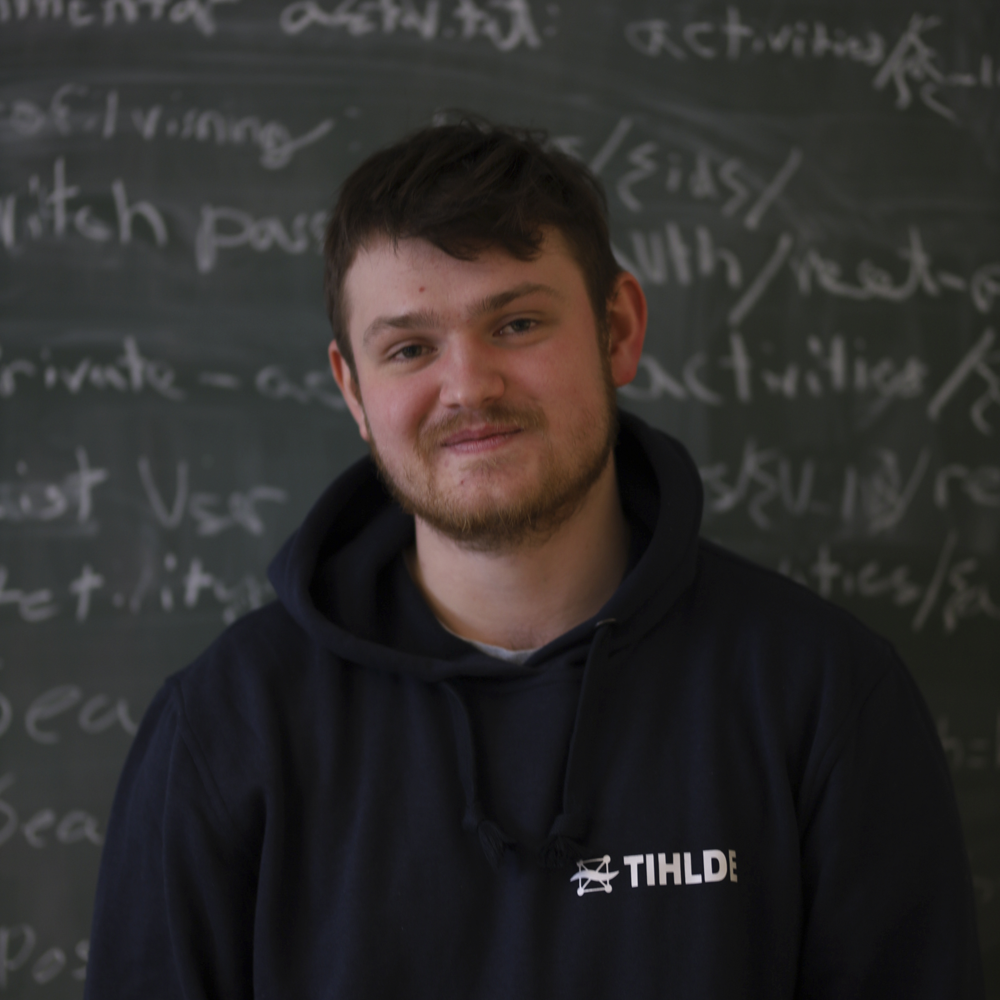

# IDATT2105-project


Prosjektet er et bookingsystem for grupperom. Her kan brukere reservere ulike rom og deler av rom. Reservasjon kan skje som enkeltperson eller som gruppe. Rom og brukere opprettes og administreres av administratorer.


## Krav for å kjøre applikasjonen
### Backend
- [Docker](https://docs.docker.com/get-docker/)
- [Make](https://www.gnu.org/software/make/) 

### Frontend
- [Node](https://nodejs.org/en/download/):


## Installasjon

### Backend

```bash
git clone https://github.com/olros/IDATT2105-project.git

cd IDATT2105-project/backend/

# Run the app without GNU Make

# With Maven  
#port 3306, 8080, and 8000 needs to be open for this to work
docker-compose up & gradlew jibDockerBuild (./gradlew jibDockerBuild for unix/linux)

# With Docker-compose
docker-compose -f docker-compose.azure.yml build
docker-compose -f docker-compose.azure.yml up

# Run the app with GNU Make

make run-unix og make run-windows

```

### Frontend

```bash
git clone https://github.com/olros/IDATT2105-project.git

cd IDATT2105-project/frontend/

# Install dependencies
yarn 

# Run the app
yarn start
```


## Medlemmer



**Hermann Owren Elton -**


**Mads Lundegaard -**


**Olaf Rosendahl -**


**Eirik Steira -**

<br/>
